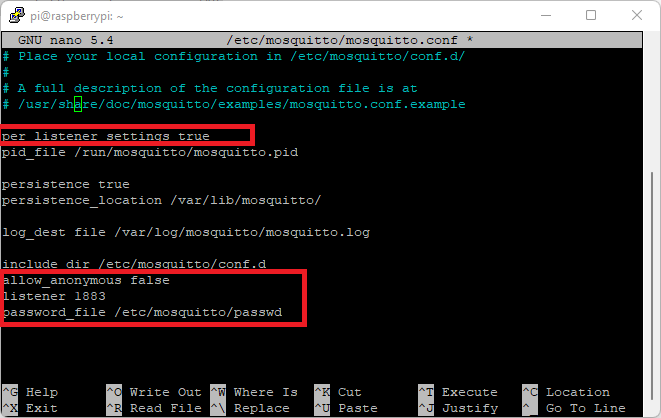

# Pinion Motion Control with MQTT interface
```                                                               
 ┌────────────────────┐          ┌───────────────────┐         ┌─────────────────────┐ 
 │ Teknic Controller  │   MQTT   │  Raspberry Pi     │   MQTT  │  GUI/HMI            │ 
 │       or           │Subscribe │  MQTT Data Broker │ Publish │ (Could Run on RasPi │ 
 │ Beckhoff PLC       │◄─────────│                   │◄────────┤  Or another Device  │ 
 │ (Must be capable of├─────────►│                   ├────────►│  With access to     │ 
 │ being MQTT Client) │  Publish │                   │Subscribe│  MQTT Broker)       │ 
 └────────────────────┘          └───────────────────┘         └─────────────────────┘ 
                                                                                       
```


## Setting up a Raspberry Pi as an MQTT Broker
The following instructions set up a Rasbperry Pi computer as a MQTT broker.  These instructions are based on the instructions from: https://randomnerdtutorials.com/how-to-install-mosquitto-broker-on-raspberry-pi/

To install mosquitto: 

`sudo apt install -y mosquitto mosquitto-clients`

To make mosquitto start when Raspberry Pi boots: 

`sudo systemctl enable mosquitto.service`

Test the installation:

`mosquitto -v`

You'll get info on the version of  mosquitto that is running and and warning: `Error: address already in use`

### Anonymous Access for any user on the network: 
Now we need to enable remote access to the broker:

`sudo nano /etc/mosquitto/mosquitto.conf`

Add the following two lines to the end of the file: 

`listener 1883`
`allow_anonymouse true`

Press `CTRL-X` and `Y` and `Enter` to save the file and close the nano editor.

now we need to restart the service:

`sudo systemctl restart mosquitto`

### Password Protected Access to the broker: 
To create a username and password for mosquitto: 

`sudo mosquitto_passwd -c /etc/mosquitto/passwd YOUR_USERNAME`

When you run the preceding command with the desired username, you’ll be asked to enter a password. No characters will be displayed while you enter the password. Enter the password and memorize the user/pass combination, you’ll need it later in your projects to make a connection with the broker.

This previous command creates a password file called passwd on the `/etc/mosquitto` directory.

Now, we need to edit the mosquitto configuration file so that it only allows authentication with the username and password we’ve defined.

`sudo nano /etc/mosquitto/mosquitto.conf`

Add the following line at the top of the file (make sure it is at the top of the file, otherwise it won’t work):

`per_listener_settings true`

Add the following three lines to allow connection for authenticated users and tell Mosquitto where the username/password file is located.

`allow_anonymous false`
`listener 1883`
`password_file /etc/mosquitto/passwd`

The `.config` file should now look like this: (**Note:** the `pid_file` line may be commented out.  That's OK!)


Save and close the config file and researt mosquitto:

`sudo systemctl restart mosquitto`

To check if mosquitto is actually running, use the following command: 

`sudo systemctl status mossquitto`