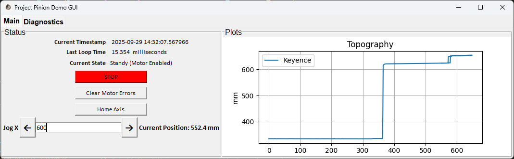

# Project Pinion 
Project Pinion began with the objective of finding a replacement for the Stepper Motor controllers used on all SAFL/NCED data carriages. SAFL/NCED carriages use Parker Zeta CompuMotors (6104 and 6108 typically) to power and control the stepper motors that move the carriages. Parker has long since discontinued the Zeta line leaving SAFL staff to purchase replacements from eBay. Project Pinion was intended to develop a drop-in replacement for the Zetas that could power the steppers and receive/parse the same serial commands that the NCED carts use to tell the Zetas where to go. Zetas have become the most frequently failed component on carts, so a replacement would go a long way to extend the life of the existing fleet of carts. 

The secondary objective was to evaluate the ClearCore controller from Teknic Inc. for use a component or the main controller of a second generation data carriage system. The ClearCore controller has many attractive features: 
- Open Source programming in the Arduino IDE
- Active support from Teknic Inc.
- The ability to control any brand stepper motor or Teknic's "Stepper Killer" servo motors
- Built in digital and analog inputs
- Digital outputs that can be used to control relays etc
- Ability to control up to 4 motors
- 2 built in serial ports, a USB port that mounts as a serial port and an Ethernet port.

## Hardware
- [ClearCore Controller](https://teknic.com/products/io-motion-controller/clcr-4-13/): $105
- [24VDC Power supply for ClearCore](https://www.digikey.com/en/products/detail/mean-well-usa-inc/EDR-150-24/7702916?s=N4IgTCBcDaILYFMCGA7A7ggNpgBAgJgE4C0AjAKwAMxYALCALoC%2BQA): $28
- [24VDC Power Supply for Stepper Driver](https://www.automationdirect.com/adc/shopping/catalog/power_products_(electrical)/dc_power_supplies/din_rail_mount/psa-24-480?gad_source=1&gad_campaignid=20953271723&gbraid=0AAAAAD_dnO2VffSUTGvznwPlpUkJoiC-C&gclid=Cj0KCQjwrc7GBhCfARIsAHGcW5Xe-U910Uq-PU4GRA1UxyrAp2Yh0SfC4OmU_1m4hwasY5AI_vxdgxcaAi0OEALw_wcB): $118
- [Stepper Motor Driver](https://www.automationdirect.com/adc/shopping/catalog/motion_control/stepper_systems/stepper_drives/em556s): $72
- [NEMA 34 Stepper Motor](https://kimcontrols.com/n31hrfk-lek-m2-00-p39110.html?srsltid=AfmBOoroYrENgZtK7RUZUiVnYYOtOgPHscDyC-5_ZvKPrmxz_tBVD-cs): $456 (Other motors could be used. There's nothing special about this motor, its just the one I had.)
- [NPN Proximity Switch](https://www.htmsensors.com/iqp2-1202n-b3u2f/?searchid=0&search_query=iqp2-1202n-) Used as limit switches. Other NPN or mechanical switches could be used.
- [E-Stop Button. Momentary NC](https://www.mcmaster.com/7546K23/): $42
- [Laser Distance Sensor Head: LK-500](https://www.keyence.com/products/measure/laser-1d/lk/models/lk-500/?search_dl=1): Discontinued (Any sensor with an analog output will work)
- [Laser Distance Sensor Controller: LK-2000](https://www.keyence.com/products/measure/laser-1d/lk/models/lk-2000/?search_dl=1): Discontinued (Any sensor with an analog output will work)

## TeknicZeta_Stepper
This folder contains files for the development of a ClearCore controller that can emulate a Zeta in controlling a single stepper on an existing SAFL/NCED Cart. The Arduino program files are located in the directory: `\pinion\TeknicZeta_Stepper\TeknicZeta`. The programs were developed using the Arduino IDE and can be recompiled and deployed into a ClearCore controller by anyone using the Arduino IDE. You can install the ClearCore Arduino Wrapper by visiting [Teknic's website](https://teknic.com/products/io-motion-controller/clcr-4-13/).

The code contained here allows the ClearCore to function as a Zeta controller and interface seamlessly with the legacy NCED/SAFL data carriages.  The same code can also be used to create new control interfaces and new functions can be added to the ClearCore code in Arduino to enable new features for future carriages.

## Pinion UI

To evaluate the ClearCore controller for use in a second generation data carriage a demo UI was developed using the Python tkinter package. This GUI is located in the directory: `\pinion\Pinion_Demo_UI`.

When the GUI starts it loads the file `Config.json`. This file contains settings that pertain to the specific cart that is being currently used. These parameters include: 
- Motion control COM port (the ID of the computer com port to use for sending/recieving motion control commands to the ClearCore)
- Software limits (min and max safe coordinates)
- DAQ COM port (The ID of the computer com port to use for receiving measurements from the ClearCore. This is a different com port than the motion control com port)
- Scale factors to scale measurements from volts to mm

### Homing 
The Pinion UI uses the jog and position move functions on the ClearCore to home the axis using the negative direction limit switch. When the user clicks the "Home" Button in the UI, Python sends a serial command to the ClearCore to initiate a constant velocity move towards the negative limit switch.  The velocity is set low (by default 5 mm/s). While the move is taking place, Python is constantly polling the status of the ClearCore, primarily for its current position and the state of the limit switchs. Once Python sees that the negative limit switch has been reached, it commands an relative position move of 10mm away from the limit switch. Then it reapproaches the limit switch at half the original speed (by default 2.5 mm/s) until it reaches the limit switch again. At this point Python sends the serial command to set the absolute position on the ClearCore to 0. 

Testing of the accuracy of this homing routine was done by mounting a dial indicator with a resolution of 0.001 inches (0.0254 mm). At the beginning of each test the axis would be homed by pressing the "Home" button in the Pinion GUI. After homing, a positional move to absolute position of 870mm was commanded. At this position the dial indictor would  be read and the measurement recorded. This process was repeated multiple times to make sure that after each homing sequence the axis would return to the same measurement on the dial indicator at postion 870mm. The results are shown in the table below and more details can be seen in the file: `./Pinion_Demo_UI/Homing_Repeatability_Test_2025-09-23.xlsx` The results show the accuracy of this homing routine to under 3 hundreths of a mm. 

| Trial # | Axis Pos(mm) | Dial Indicator (in) | Dial Indicator (mm) | Difference (mm) |
| :-----: | :----------: | :-----------------: | :-----------------: | :--------: |
| 0       | 870          | 0.300               | 7.62                |    --      |
| 1       | 870          | 0.3005              | 7.6327              | 0.0127     |
| 2       | 870          | 0.301               | 7.6454              | 0.0254     |
| 3       | 870          | 0.301               | 7.6454              | 0.0254     |
| 4       | 870          | 0.301               | 7.6454              | 0.0254     |

### Jog Controls
The GUI contains jog contol buttons that can be used to manually move the axis. By clicking and holding the left or right arrows, the axis will start a velocity move. Letting go of the button will stop the movement of the axis. While the axis is in motion the "Current Position" value to the right of the jog buttons will update with the current position. While pressing the jog buttons, the motors will be permitted to move all the way to the limit switches - the software limits will not be utilized. 

Located between the two left and right arrow buttons is a text entry window. In this entry, the user can type in a coordinate that they would like the axis to move to. After typing in the position you would like to move to press the Enter key on your keyboard to start the move. In this mode, the software limits will be in effect, ensuring that the axis does not exceed the preset safe envelope. 

### Realtime Data Plots
Any time the axis is moving the realtime plot of measurements will update. Measaurements when the axis has moved 1 mm. When jogging or homing, the measurements will just be added to the existing plot. When making a positional move (typing in a coordinate and pressing "Enter") the plot will be cleared at the beginning of the move so that the only measurements displayed are from that positional move.

## Installation Notes:
### Notes on programming in the Arduino IDE
Maybe this issue is specific to my installation of the Arduino IDE, but I couldn't get any of the examples to compile at first.  I had to copy all the header files in `C:\Users\milli079\AppData\Local\Arduino15\packages\arduino\tools\CMSIS\4.5.0\CMSIS\Include` 

to 

`C:\Users\milli079\AppData\Local\Arduino15\packages\ClearCore\hardware\sam\1.7.0\variants\clearcore\Third Party\SAME53\CMSIS\Device\Include`  

Then it would compile.